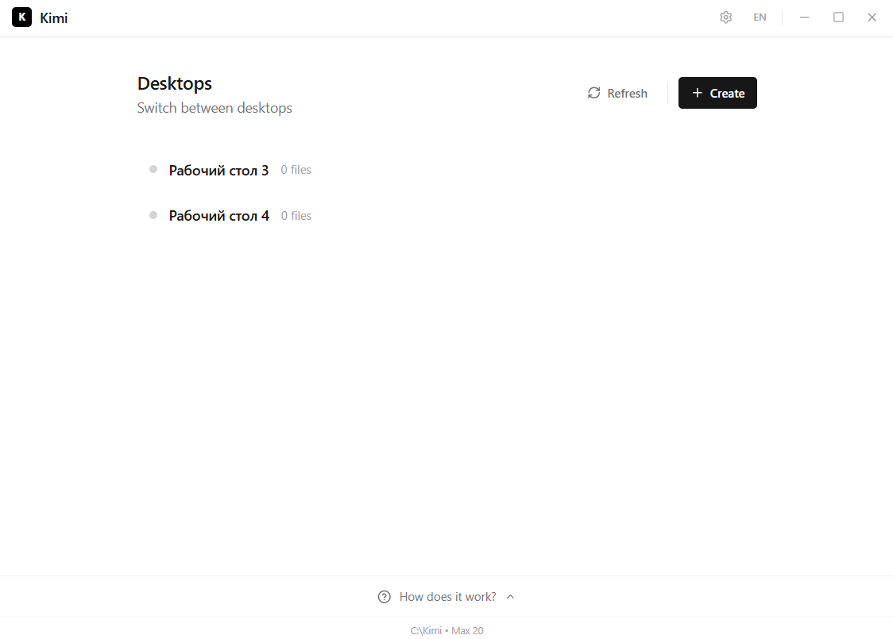
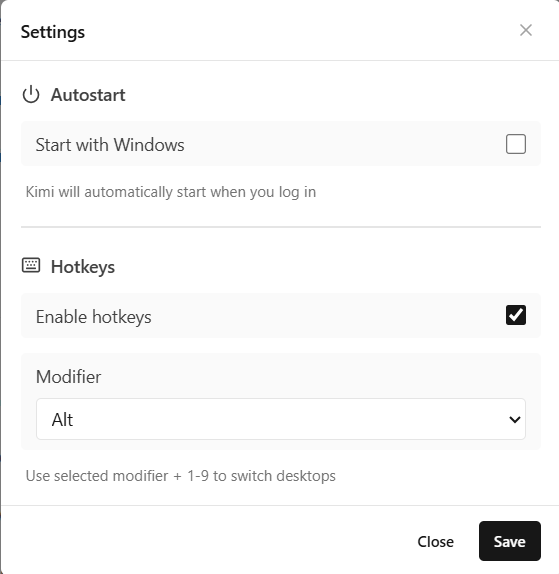
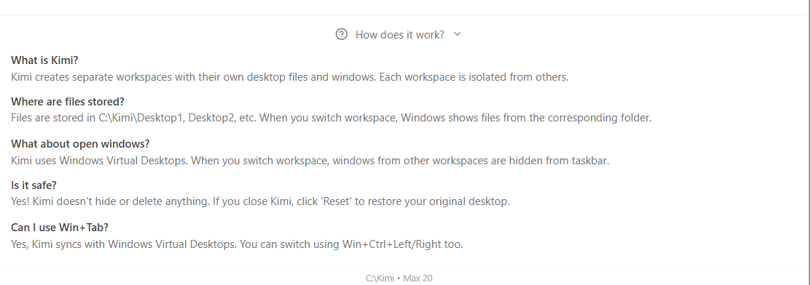

<p align="center">
  
</p>

<h1 align="center">Kimi</h1>

<p align="center">
  Desktop manager for Windows
</p>

<p align="center">
  <a href="README.md"><b>English</b></a> • <a href="README.ru.md">Русский</a>
</p>

<p align="center">
  <a href="../../releases/latest"></a>
  <a href="../../releases/latest"></a>
  
</p>

---

<p align="center">
  
</p>

## Features

- Multiple desktops with separate files and icons
- Icon position saving for each desktop
- Hotkeys for quick switching
- Autostart with Windows
- System tray support

<p align="center">
  
</p>

## How it works

<p align="center">
  
</p>

Kimi combines two approaches:

| Approach | Description |
|----------|-------------|
| Virtual Desktops | Uses Windows Virtual Desktops (Win+Tab) for desktop switching and window management |
| Separate Folders | Each desktop has its own folder with files and saved icon positions |

## Installation

<a href="../../releases/latest">
  
</a>

## Requirements

- Windows 10/11
- Administrator rights

## Why not Dexpot?

| | Kimi | Dexpot |
|---|---|---|
| Technology | Native Windows API + Rust | Legacy COM hooks |
| Virtual Desktops | Uses built-in Windows 10/11 virtual desktops | Custom implementation, conflicts with Windows |
| Icon positions | Saved per desktop, restored instantly | Often loses positions, lags |
| Memory | ~15 MB | ~50-100 MB |
| Updates | Active development | Abandoned since 2017 |

## Technical Details

Kimi uses low-level Windows API for reliable desktop management.

**Changing Desktop Path**

```rust
// shell.rs — switching system Desktop folder
SHSetKnownFolderPath(
    &FOLDERID_Desktop,
    KF_FLAG_DONT_UNEXPAND.0 as u32,
    HANDLE::default(),
    PCWSTR::from_raw(wide_path.as_ptr()),
)
```

**Virtual Desktop Switching**

```rust
// api.rs — using winvd crate for Windows Virtual Desktops
pub fn switch_to_desktop(index: usize) -> Result<(), String> {
    winvd::go_to_desktop(index).map_err(|e| format!("{:?}", e))
}

pub fn move_window(hwnd: isize, desktop: usize) -> Result<(), String> {
    winvd::move_window_to_desktop(hwnd as u32, desktop)
        .map_err(|e| format!("{:?}", e))
}
```

**Refreshing Explorer**

```rust
// shell.rs — sending F5 to desktop ListView
unsafe fn send_f5(hwnd: HWND) {
    PostMessageW(hwnd, WM_KEYDOWN, WPARAM(VK_F5), LPARAM(0));
    std::thread::sleep(std::time::Duration::from_millis(50));
    PostMessageW(hwnd, WM_KEYUP, WPARAM(VK_F5), LPARAM(0));
}
```

**Icon Position Storage**

```rust
// storage.rs — saving positions to hidden file
pub fn save_icon_positions(desktop_path: &Path, layout: &DesktopIconsLayout) {
    let coords_file = desktop_path.join("coords.kimi");
    let content = serde_json::to_string_pretty(layout)?;
    fs::write(&coords_file, content)?;
    hide_file(&coords_file); // FILE_ATTRIBUTE_HIDDEN
}
```

## Build from source

```bash
git clone https://github.com/Masonik2080/kimi.git
cd kimi
npm install
npm run tauri build
```

## License

MIT
