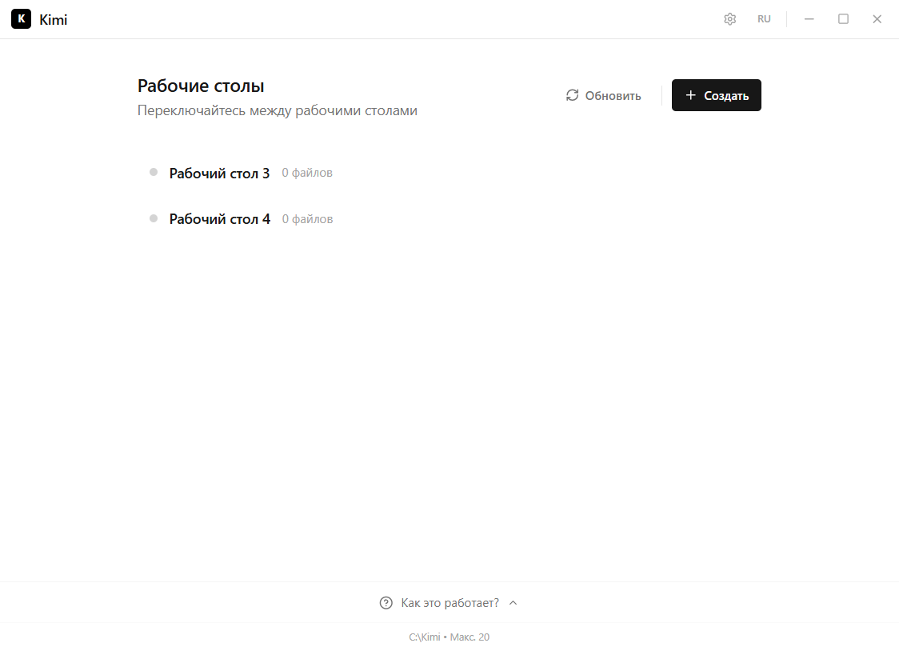
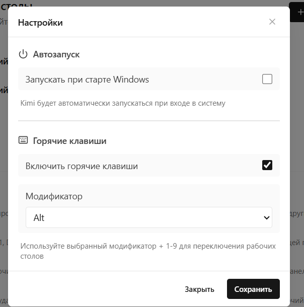
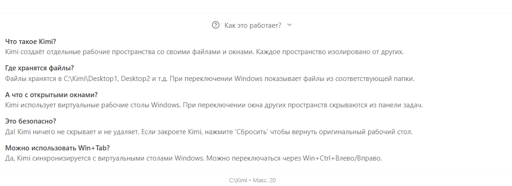

<p align="center">
  
</p>

<h1 align="center">Kimi</h1>

<p align="center">
  Менеджер рабочих столов для Windows
</p>

<p align="center">
  <a href="README.md">English</a> • <a href="README.ru.md"><b>Русский</b></a>
</p>

<p align="center">
  <a href="../../releases/latest"></a>
  <a href="../../releases/latest"></a>
  
</p>

---

<p align="center">
  
</p>

## Возможности

- Несколько рабочих столов с отдельными файлами и иконками
- Сохранение позиций иконок для каждого стола
- Горячие клавиши для быстрого переключения
- Автозапуск с Windows
- Работа в трее

<p align="center">
  
</p>

## Как работает

<p align="center">
  
</p>

Kimi комбинирует два подхода:

| Подход | Описание |
|--------|----------|
| Виртуальные столы | Использует виртуальные рабочие столы Windows (Win+Tab) для переключения и управления окнами |
| Отдельные папки | Каждый стол имеет свою папку с файлами и сохранёнными позициями иконок |

## Установка

<a href="../../releases/latest">
  
</a>

## Требования

- Windows 10/11
- Права администратора

## Почему не Dexpot?

| | Kimi | Dexpot |
|---|---|---|
| Технология | Нативный Windows API + Rust | Устаревшие COM-хуки |
| Виртуальные столы | Использует встроенные столы Windows 10/11 | Своя реализация, конфликтует с Windows |
| Позиции иконок | Сохраняются для каждого стола, восстанавливаются мгновенно | Часто теряет позиции, лагает |
| Память | ~15 МБ | ~50-100 МБ |
| Обновления | Активная разработка | Заброшен с 2017 года |

## Техническая реализация

Kimi использует низкоуровневый Windows API для надёжного управления рабочими столами.

**Смена пути Desktop**

```rust
// shell.rs — переключение системной папки Desktop
SHSetKnownFolderPath(
    &FOLDERID_Desktop,
    KF_FLAG_DONT_UNEXPAND.0 as u32,
    HANDLE::default(),
    PCWSTR::from_raw(wide_path.as_ptr()),
)
```

**Переключение виртуальных столов**

```rust
// api.rs — используем winvd для работы с виртуальными столами Windows
pub fn switch_to_desktop(index: usize) -> Result<(), String> {
    winvd::go_to_desktop(index).map_err(|e| format!("{:?}", e))
}

pub fn move_window(hwnd: isize, desktop: usize) -> Result<(), String> {
    winvd::move_window_to_desktop(hwnd as u32, desktop)
        .map_err(|e| format!("{:?}", e))
}
```

**Обновление Explorer**

```rust
// shell.rs — отправляем F5 в ListView рабочего стола
unsafe fn send_f5(hwnd: HWND) {
    PostMessageW(hwnd, WM_KEYDOWN, WPARAM(VK_F5), LPARAM(0));
    std::thread::sleep(std::time::Duration::from_millis(50));
    PostMessageW(hwnd, WM_KEYUP, WPARAM(VK_F5), LPARAM(0));
}
```

**Хранение позиций иконок**

```rust
// storage.rs — сохраняем позиции в скрытый файл
pub fn save_icon_positions(desktop_path: &Path, layout: &DesktopIconsLayout) {
    let coords_file = desktop_path.join("coords.kimi");
    let content = serde_json::to_string_pretty(layout)?;
    fs::write(&coords_file, content)?;
    hide_file(&coords_file); // FILE_ATTRIBUTE_HIDDEN
}
```

## Сборка из исходников

```bash
git clone https://github.com/Masonik2080/kimi.git
cd kimi
npm install
npm run tauri build
```

## Лицензия

MIT
